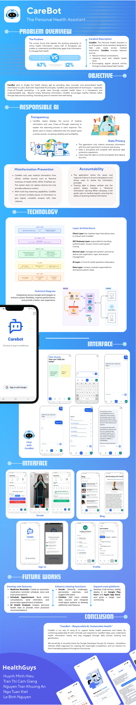

# Carebot

Carebot is a comprehensive health and wellness mobile application designed to help users track health habits, access quality health information, and receive personalized health guidance.



## Features

- **Health News**: Browse and read the latest health articles from trusted sources like Healthline.
- **AI Health Assistant**: Chat with an AI-powered assistant for real-time health guidance.
- **Streak Tracker**: Track and visualize your daily health habit streaks.
- **User Profile**: Customize your personal experience with a secure profile.
- **Health Information**: Access curated knowledge on nutrition, fitness, mental health, and chronic conditions.

## Prerequisites

- **Node.js** v14 or newer
- **[Bun](https://bun.sh)** as the package manager
- **Expo CLI** (install with `npm install -g expo-cli`)
- iOS Simulator or Android Emulator for local testing *(optional)*

## Getting Started

**1. Clone the project**

```bash
git clone https://github.com/dunnokiet/carebot.git
cd carebot
```

**2. Install dependencies**

```bash
bun install
```

**3. Set up environment variables**

- Copy `.env.example` to `.env` and fill in required values.
- Include your Firebase credentials and API base URL.

**4. Start the app**

```bash
bunx expo start
```

- Press `i` for iOS simulator
- Press `a` for Android emulator
- Or scan the QR code with the **Expo Go app**

## Backend Integration

This app works with a dedicated backend available here: **[carebot-backend](https://github.com/Healer-H/carebot-backend/tree/master/chatbot_service)**

The frontend uses this URL to fetch AI responses, health articles, and manage user data.

## Feature Details

**Health News Feed**

- Read curated health content from Healthline. Topics include mental wellness, disease prevention, and fitness tips.

**AI Health Assistant**

- Answer health questions
- Provide wellness suggestions
- Recommend lifestyle improvements

**Streak Tracker**

- Set and track daily goals
- Build habit streaks
- Visualize progress over time

**Authentication & User Profiles**

- Secure login via Firebase
- Personalized health dashboard
- Data synced across devices

## Development Tips

**Adding New Features**

1. Add components to the relevant folder.
2. Update routing in `app/`.
3. Adjust navigation if necessary.
4. Test responsiveness and functionality.

**Linting & Formatting**

- Format code with Prettier

```bash
bun run lint
```

## Acknowledgements

- **Healthline** – Health data and articles
- **Gemini / OpenAI** – Conversational AI
- **Firebase** – Authentication & backend support
- **Expo** – App development framework

## Contributors


